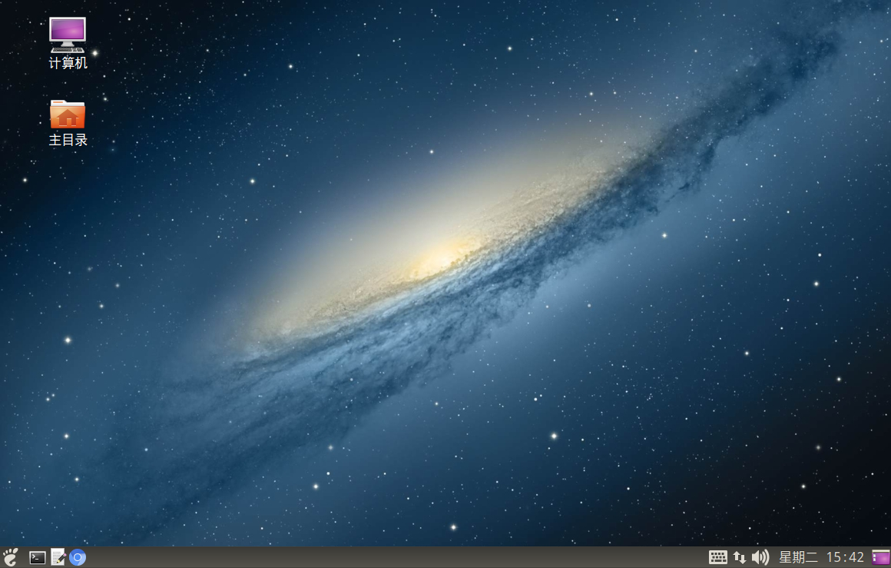
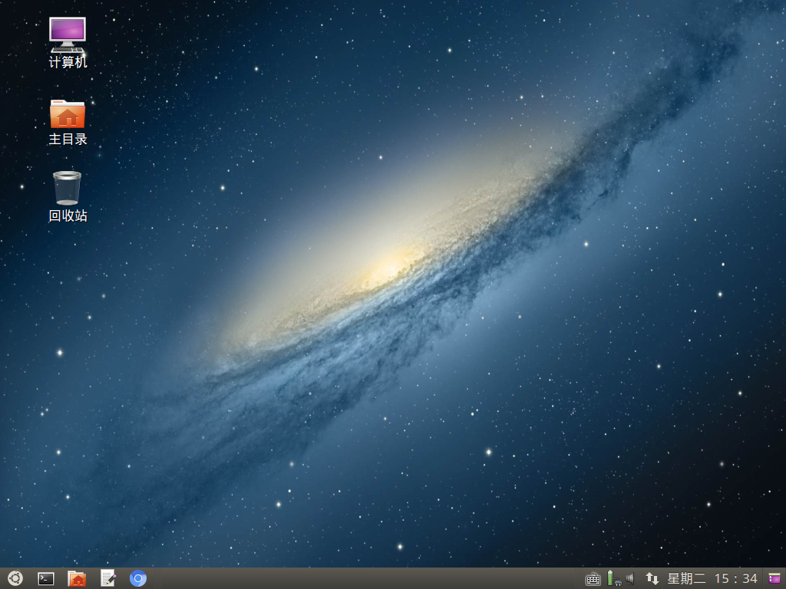

# Ubuntu Classic Desktop (GTK3-based Desktop Environment)

------------------------------------------

### Ubuntu 18.04 LTS CDImage Download Links (~441MB):

PC (64 bit): https://github.com/ghostplant/ubuntu-classic/releases/download/ubuntu-18.04/bionic-mate-amd64-20180927.iso

PC (32 bit): https://github.com/ghostplant/ubuntu-classic/releases/download/ubuntu-18.04/bionic-mate-i386-20180927.iso

### Ubuntu 16.04 LTS CDImage Download Links (~378MB):

http://ppa.launchpad.net/ghostplant/flashback/ubuntu/pool/main/x/xenial-classic-desktop-amd64/


## Ubuntu 18.04 LTS Preview



## Ubuntu 16.04 LTS Preview



------------------------------------------

## You can also run Ubuntu Classic Desktop 18.04 in Docker (with VNC):

```sh
# Default VNC password: 123456 (update it via 'vncpasswd' command inside VNC session)

# Using web browser to login - http://localhost:8443/
docker run -it --rm -p 8443:8443 -v /external:/root ghostplant/flashback

# Using VNC client to login 'localhost:1'
docker run -it --rm -h flashback -p 5901:5901 -v /external:/root ghostplant/flashback

# Example: Set locale to en_US.UTF-8
docker run -it --rm -e LANG=en_US.UTF-8 -p 8443:8443 -p 5901:5901 -v /external:/root ghostplant/flashback

# Example: Set resolution to 1366x768
docker run -it --rm -e GEOMETRY=1366x768 -p 8443:8443 -p 5901:5901 -v /external:/root ghostplant/flashback

# Example: Set initial VNC password (length of password must be between 6 to 8). If ~/.vnc/passwd already exists, manual INIT_PASS won't take effect.
docker run -it --rm -e INIT_PASS=123456 -p 8443:8443 -p 5901:5901 -v /external:/root ghostplant/flashback
```

Then use Firefox/Chrome/IE11 to login if you expose port 8443:

```sh
x-www-browser http://localhost:8443/

x-www-browser https://localhost:8443/
```

or use Linux Gvncviewer or Windows RealVNC to login if you expose port 5901:

```sh
gvncviewer localhost:1
```
------------------------------------------

## Reporting Issues

You can post issues here for any suggestions to improve Ubuntu Classic Desktop. To report a new issue, you are supposed to have a GitHub account and log in with it in the first place. Then, get access to [new issue](https://github.com/ghostplant/ubuntu-classic/issues/new), fill in the block with what you want to report, and finally submit this issue.
